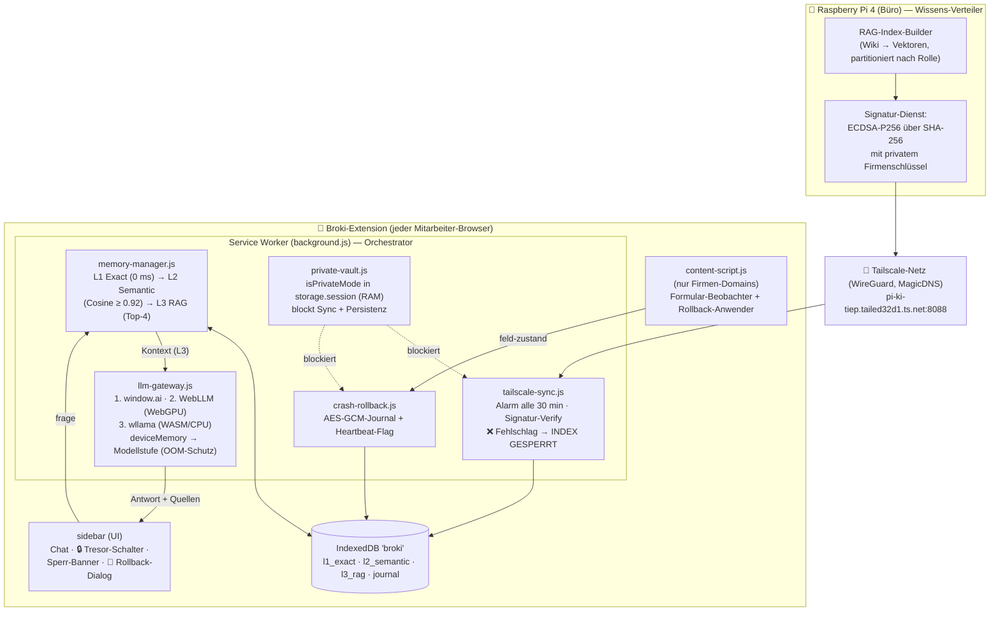
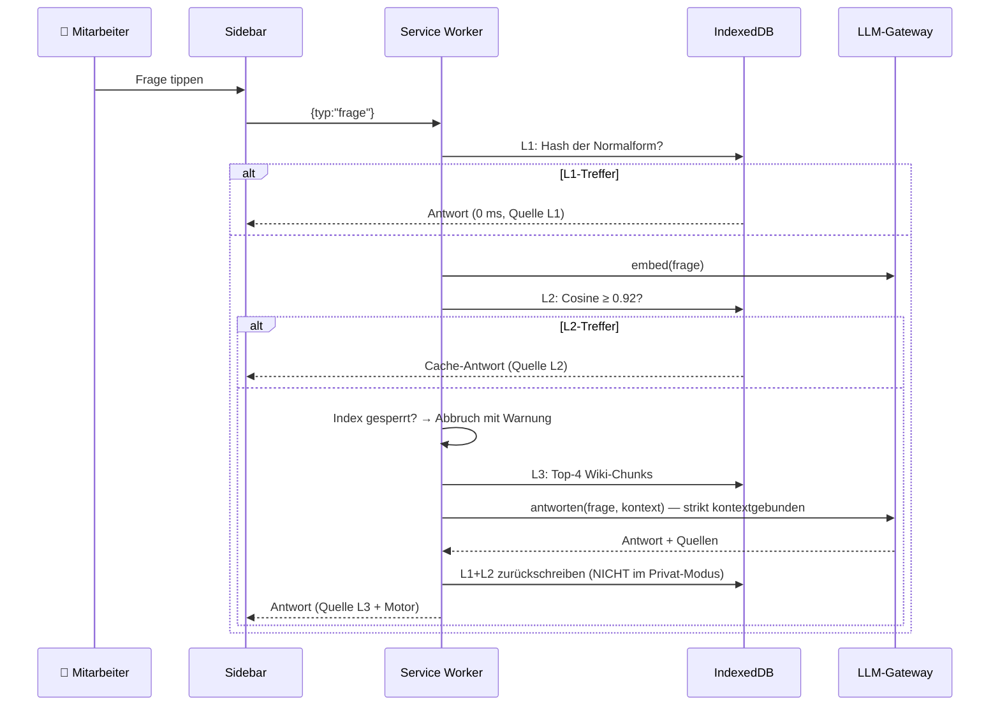

# 🏗️ Architektur-Plan: Broki AI Browser-Extension (Manifest V3)

> Erstellt 18.07.2026 (CEO-Auftrag Senior-Architektur). Pflege-Regel: bei jeder
> Änderung MITaktualisieren. Verwandt: [[Architektur-Themen-Assistent]],
> Businessplan: `Businessplanung und Produkt Konzept der Broki AI.docx`

## 1. Systemübersicht



## 2. Ablauf einer Frage (Memory-Kaskade)



## 3. Verzeichnisstruktur

```
broki-extension/
├── manifest.json              MV3: SW (module), side_panel, alarms, host_permissions (nur Pi)
├── background.js              Orchestrator + Message-Bus (einzige Verdrahtungsstelle)
├── config/broki-config.js     ALLES Firmen-/Deployment-Spezifische (Pi-URL, Key, Rollen, Stufen)
├── modules/
│   ├── tailscale-sync.js      Index-Sync + ECDSA/SHA-256-Verify + Sperr-Logik (fail closed)
│   ├── memory-manager.js      3-Stufen-Kaskade + Rückschreiben + TTL/Deckelung
│   ├── llm-gateway.js         Motor-Auswahl + OOM-Schutz + RAG-Prompt + Embedding(+Fallback)
│   ├── private-vault.js       RAM-Sandbox (storage.session + SW-Map, Tab-Aufräumer)
│   ├── crash-rollback.js      verschlüsseltes Journal + Heartbeat-Crash-Erkennung
│   ├── crypto-utils.js        WebCrypto: SHA-256, ECDSA-Verify, AES-GCM
│   └── db.js                  IndexedDB-Wrapper (4 Stores)
├── content/content-script.js  Formular-Beobachter (entprellt) + Rollback-Anwender
├── sidebar/sidebar.html|.js   Chat-UI, Tresor-Schalter, Banner, Rollback-Dialog
└── vendor/                    WebLLM + wllama + GGUF-Modelle (Build-Schritt, gitignored)
```

## 4. Sicherheits-Entscheidungen (und ihr Warum)

| Entscheidung | Warum |
|---|---|
| ECDSA-Signatur statt nacktem SHA-256-Vergleich | Ein Angreifer auf dem Pi könnte zum manipulierten Index einfach den passenden Hash mitliefern — die Signatur kann er ohne privaten Firmenschlüssel NICHT fälschen |
| Fail closed (Index sperren) | Lieber „keine Antwort, IT rufen" als eine vergiftete Antwort (Data Poisoning) |
| Atomare Index-Übernahme | Erst wenn ALLE Partitionen verifiziert sind, wird der alte Index ersetzt — nie ein halber Zustand |
| `isPrivateMode` in `storage.session` | Lebt nur im RAM des laufenden Browsers — Browser zu = Modus + Tresor restlos weg |
| Rollback-Journal AES-GCM | Schutz „at rest"; ehrlich dokumentiert: schützt nicht gegen Angreifer mit vollem Profil-Zugriff |
| host_permissions NUR Pi-URL | Extension kann technisch nirgendwo anders hin funken — prüfbar im Manifest (Betriebsrat-Argument) |
| Heartbeat statt onSuspend-Vertrauen | onSuspend feuert bei echtem Crash gerade NICHT — genau das macht das Flag zum Crash-Detektor |

## 5. Erweiterungspunkte

| Erweiterung | Wo ändern | Was NICHT anfassen |
|---|---|---|
| Neue Firma / neuer Pi | `config/broki-config.js` + manifest host_permissions/matches | Module unverändert |
| Neue Rolle | Pi-seitig neue Partition; Extension: Rolle in storage setzen | Sync-Logik identisch |
| Neuer LLM-Motor | Neuer Block in `llm-gateway.js#_init` (Adapter-Muster) | Memory/Sync/UI |
| Besseres Embedding | `embed()` im Gateway (z. B. transformers.js-Modell) | L2/L3-Logik bleibt (Re-Embedding nötig) |
| Feed-/Wissens-Import | Wasm-`feed-scraper` (Phase 2) als zusätzliche Wissensquelle des Pi | Extension merkt nichts davon |

## 5b. Ausbau-Ideen aus dem erweiterten Businessplan (18.07.2026)

Der Plan (118k Z.) beschreibt drei Ausbaustufen, die die aktuelle Sync-Architektur
(Pi → signierter Index → Client) NICHT ersetzen, sondern ergänzen:

| Idee | Was | Einordnung Prüfer/Architekt |
|---|---|---|
| **P2P Knowledge Sharing (WebRTC)** | Clients tauschen neue Wissens-Vektoren direkt im LAN aus („Gossip/Flüster-Netzwerk"), statt nur zentral über den Pi | Reizvoll, aber Komplexität hoch (NAT, Konsistenz, Vergiftungs-Schutz P2P). **Erst NACH** dem zentralen Pi-Sync; nicht v1. Sicherheit: gleiche Signaturpflicht wie zentral |
| **Zero-Trust Partner-Netzwerk** | Externen Partnern einen GEFILTERTEN Teil des RAG-Index geben (Wissen teilen, nie Systemzugang) | Passt sauber aufs Rollen-Modell (neue Partition „partner" + eigener Public-Key). Guter B2B-Hebel Phase 2 |
| **Auto-Learning aus Nutzer-Feedback** | Lokales Fine-Tuning/Feedback verbessert den Client über Zeit | Vorsicht: lokale Modell-Drift + kein Rückkanal in den signierten Kollektiv-Index. Als reine L1/L2-Cache-Anreicherung ok; echtes Finetuning = späteres Forschungsthema |
| **Hermes-Loop (autonome Skill-Generierung)** | Beobachtet repetitive Klicks/Formulare → schlägt lokal generierten Workflow vor („Soll ich das ab jetzt für dich machen?") | Baut auf dem bestehenden Crash-Rollback-Beobachter auf (der protokolliert schon Feldeingaben). **Vision-Feature 2027**, hohes WOW im Pitch; v1 zu komplex/riskant (Autonomie-Freigaben, Fehlerhaftung) |
| **Autonome Teamfähigkeit (Mesh-Schwarm)** | Rollen-Sub-Agenten auf mehreren Laptops; großes Dokument wird per WebRTC an Kollegen mit freien CPUs verteilt (Task-Chunking) → kollektive Synthese, komplett serverlos | Starke Investoren-Vision („Post-Cloud-Ära, Schwarm-Intelligenz"). Technisch weit (WebRTC-Mesh, Scheduling, Konsistenz). Klar als **Vision 2027/2028** kennzeichnen, NICHT als Jahr-1-Zusage verkaufen |

**Wettbewerbs-Abgrenzung (aus dem Plan, für Pitch/README):** vs. M365 Copilot =
lokal statt Cloud, plattformübergreifend (jede Web-App, auch SAP/CRM), 0 € statt
~30 €/Seat; vs. WebLLM/WebChatLLM = proaktive Extension mit Firmen-RAG statt
passiver Chat-Demo, Modell gecacht statt jedes Mal 2–4 GB neu.

## 5c. IP-/Kopierschutz — „Wie schütze ich Broki vor Nachbau?" (CEO-Frage)

Der Plan skizziert eine 4-stufige „IP-Schutzburg". Architekt-Einordnung nach
Aufwand vs. Wirkung — **Reihenfolge = Empfehlung**:

| Stufe | Methode | Bewertung / wann |
|---|---|---|
| **1. Lizenz-Wächter (Chef-Schlüssel)** ⭐ | Extension bleibt gratis ladbar, aber UI + RAG schalten NUR mit signiertem Lizenz-Zertifikat frei, kryptografisch an die Firmen-Domain gebunden. Kopie ohne gültige Signatur = tot. | **SOFORT machbar** — nutzt die BEREITS gebaute ECDSA-Signaturkette (`sign_utils.py`/`crypto-utils.js`)! Selbe Technik wie Index-Signatur, nur ein zusätzliches Lizenz-Objekt. Bester ROI, gehört in v1. |
| **2. Rechtsschutz** | Urheberrecht (automatisch, ermöglicht DMCA-Takedown aus dem Web Store bei 1:1-Kopie) + **Marke „Broki AI"** anmelden. | Günstig/schnell (Marke ein paar hundert €). Sollte parallel laufen — schützt den Namen im Enterprise-Markt. |
| **3. WASM-Obfuskation** | Kernlogik in C++/Rust → Emscripten → `.wasm`-Bytecode, Debug-Symbole/Source-Maps strippen, Control-Flow-Obfuscation (LLVM-Obfuscator). | Echter Aufwand (Kernlogik umschreiben). Lohnt erst, wenn zahlende Kunden da sind. wllama IST schon WASM — eigene Logik nachziehen ist Stufe 2+. |
| **4. Netzwerk-Geheimnis (Protokoll-USP)** | Der eigentliche, nicht kopierbare Wert ist das dezentrale WebRTC-Mesh-Protokoll — ein Einzel-Browser-LLM (WebChatLLM) ist trivial kopierbar, das Zusammenspiel nicht. | Ergibt sich automatisch, WENN das Mesh (5b) gebaut wird. Bis dahin theoretisch. |

**Kernaussage für den CEO:** Der wirksamste Schutz ist NICHT Verschleierung,
sondern der **Lizenz-Wächter** — und den kann Broki quasi geschenkt bekommen,
weil die Signatur-Infrastruktur schon steht. Nachbau des sichtbaren JS ist
möglich, aber wertlos ohne dein signiertes Lizenz-Zertifikat + (später) das Mesh.

## 6. Offene Punkte (ehrlich)

1. **Pi-Gegenstück** (Index-Builder + Signatur-Dienst + HTTP-Server) — eigenes Arbeitspaket,
   gehört ins AI-OS (Python, läuft auf pi-ki-tiep).
2. **vendor/** muss befüllt werden (WebLLM/wllama npm-Pakete + GGUF-Modelle) — Build-Skript folgt.
3. window.ai-Namensräume differieren je Browser-Generation — Gateway probt defensiv 3 Varianten.
4. **Gate:** `wirtschaftlichkeit-broki-ai.md` → GO_MIT_AUFLAGEN (18.07.2026, mit
   Businessplan-Zahlen: SaaS-Light 5–10 €/Seat/M, GTM „Trojanisches Pferd").
   Status WARTET_AUF_FREIGABE. P2P/Zero-Trust/BSI sind ausdrücklich Phase 2+.
