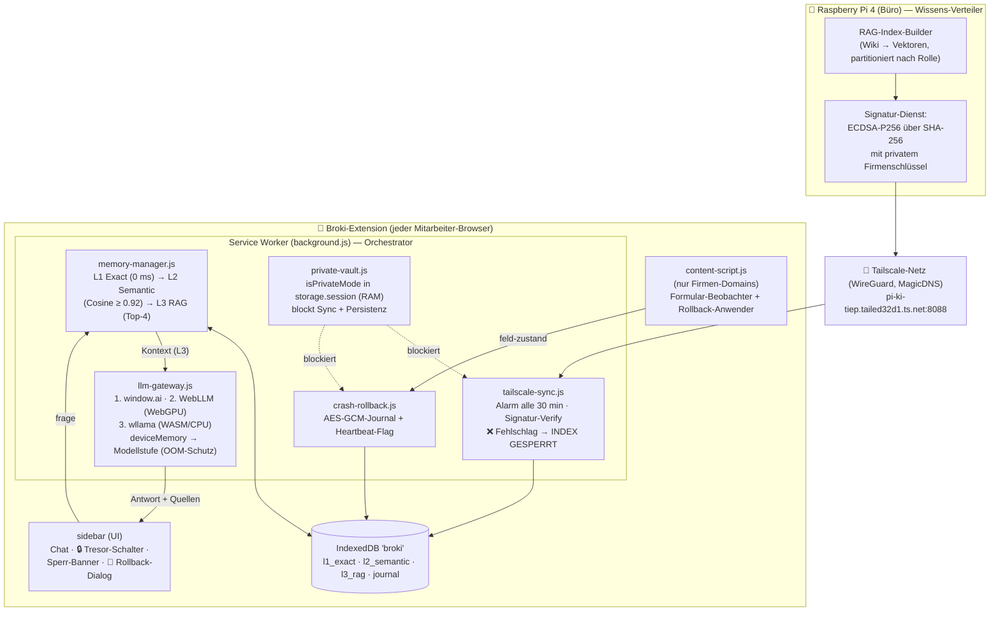
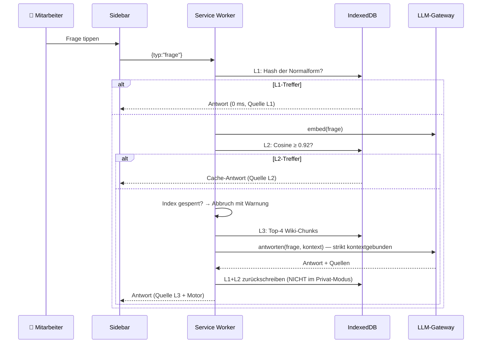

# 🏗️ Architektur-Plan: Broki AI Browser-Extension (Manifest V3)

> Erstellt 18.07.2026 (CEO-Auftrag Senior-Architektur). Pflege-Regel: bei jeder
> Änderung MITaktualisieren. Verwandt: [[Architektur-Themen-Assistent]],
> Businessplan: `Businessplanung und Produkt Konzept der Broki AI.docx`

## 1. Systemübersicht



## 2. Ablauf einer Frage (Memory-Kaskade)



## 3. Verzeichnisstruktur

```
broki-extension/
├── manifest.json              MV3: SW (module), side_panel, alarms, host_permissions (nur Pi)
├── background.js              Orchestrator + Message-Bus (einzige Verdrahtungsstelle)
├── config/broki-config.js     ALLES Firmen-/Deployment-Spezifische (Pi-URL, Key, Rollen, Stufen)
├── modules/
│   ├── tailscale-sync.js      Index-Sync + ECDSA/SHA-256-Verify + Sperr-Logik (fail closed)
│   ├── memory-manager.js      3-Stufen-Kaskade + Rückschreiben + TTL/Deckelung
│   ├── llm-gateway.js         Motor-Auswahl + OOM-Schutz + RAG-Prompt + Embedding(+Fallback)
│   ├── private-vault.js       RAM-Sandbox (storage.session + SW-Map, Tab-Aufräumer)
│   ├── crash-rollback.js      verschlüsseltes Journal + Heartbeat-Crash-Erkennung
│   ├── crypto-utils.js        WebCrypto: SHA-256, ECDSA-Verify, AES-GCM
│   └── db.js                  IndexedDB-Wrapper (4 Stores)
├── content/content-script.js  Formular-Beobachter (entprellt) + Rollback-Anwender
├── sidebar/sidebar.html|.js   Chat-UI, Tresor-Schalter, Banner, Rollback-Dialog
└── vendor/                    WebLLM + wllama + GGUF-Modelle (Build-Schritt, gitignored)
```

## 4. Sicherheits-Entscheidungen (und ihr Warum)

| Entscheidung | Warum |
|---|---|
| ECDSA-Signatur statt nacktem SHA-256-Vergleich | Ein Angreifer auf dem Pi könnte zum manipulierten Index einfach den passenden Hash mitliefern — die Signatur kann er ohne privaten Firmenschlüssel NICHT fälschen |
| Fail closed (Index sperren) | Lieber „keine Antwort, IT rufen" als eine vergiftete Antwort (Data Poisoning) |
| Atomare Index-Übernahme | Erst wenn ALLE Partitionen verifiziert sind, wird der alte Index ersetzt — nie ein halber Zustand |
| `isPrivateMode` in `storage.session` | Lebt nur im RAM des laufenden Browsers — Browser zu = Modus + Tresor restlos weg |
| Rollback-Journal AES-GCM | Schutz „at rest"; ehrlich dokumentiert: schützt nicht gegen Angreifer mit vollem Profil-Zugriff |
| host_permissions NUR Pi-URL | Extension kann technisch nirgendwo anders hin funken — prüfbar im Manifest (Betriebsrat-Argument) |
| Heartbeat statt onSuspend-Vertrauen | onSuspend feuert bei echtem Crash gerade NICHT — genau das macht das Flag zum Crash-Detektor |

## 5. Erweiterungspunkte

| Erweiterung | Wo ändern | Was NICHT anfassen |
|---|---|---|
| Neue Firma / neuer Pi | `config/broki-config.js` + manifest host_permissions/matches | Module unverändert |
| Neue Rolle | Pi-seitig neue Partition; Extension: Rolle in storage setzen | Sync-Logik identisch |
| Neuer LLM-Motor | Neuer Block in `llm-gateway.js#_init` (Adapter-Muster) | Memory/Sync/UI |
| Besseres Embedding | `embed()` im Gateway (z. B. transformers.js-Modell) | L2/L3-Logik bleibt (Re-Embedding nötig) |
| Feed-/Wissens-Import | Wasm-`feed-scraper` (Phase 2) als zusätzliche Wissensquelle des Pi | Extension merkt nichts davon |

## 6. Offene Punkte (ehrlich)

1. **Pi-Gegenstück** (Index-Builder + Signatur-Dienst + HTTP-Server) — eigenes Arbeitspaket,
   gehört ins AI-OS (Python, läuft auf pi-ki-tiep).
2. **vendor/** muss befüllt werden (WebLLM/wllama npm-Pakete + GGUF-Modelle) — Build-Skript folgt.
3. window.ai-Namensräume differieren je Browser-Generation — Gateway probt defensiv 3 Varianten.
4. **Gate-Hinweis:** Broki AI hat einen eigenen Businessplan (102k Zeichen, docx) →
   eigene Wirtschaftlichkeitsprüfung nach Regel 4 vor Launch/Vermarktung fällig
   (Kern-Umsetzung hier war expliziter CEO-Auftrag).
