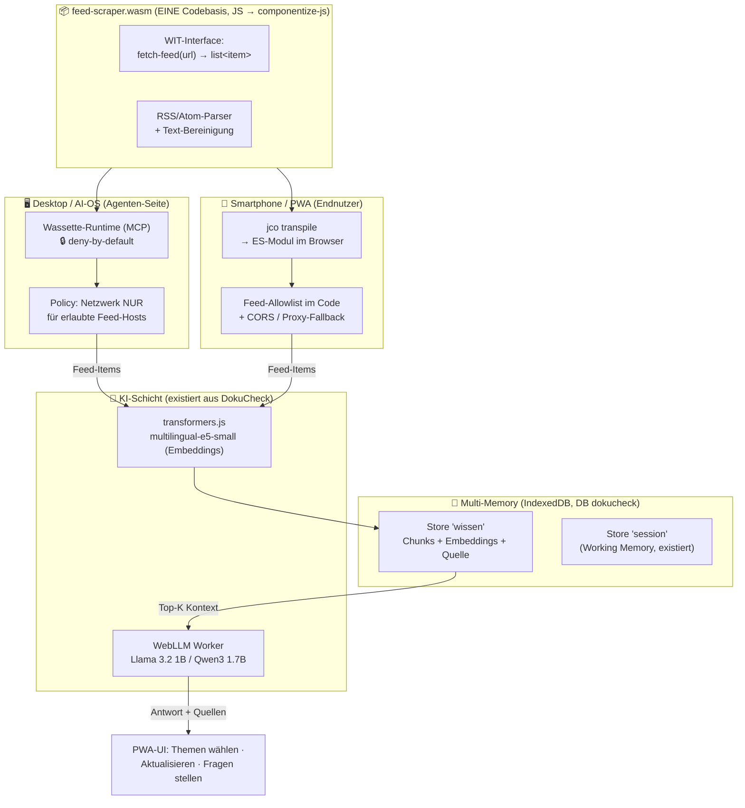
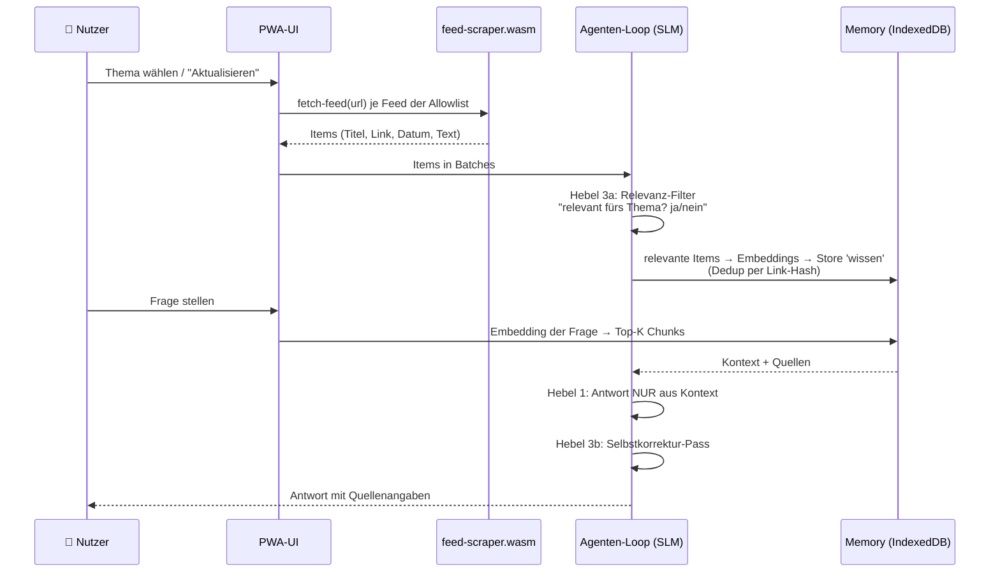

# 🏗️ Architektur-Plan: Themen-Assistent (Self-Evolving Stufe 2)

> Erstellt 17.07.2026 zur Gate-Freigabe. Pflege-Regel: Bei jeder Änderung/
> Erweiterung dieses Diagramm MITaktualisieren — es ist die Referenz für
> Fehlersuche und spätere Anpassungen. Verwandt: [[Bauplan-Feed-Scraper-Wasm]],
> [[Analyse-Browser-vs-Native]], [[wirtschaftlichkeit-themen-assistent]]

## 1. Systemübersicht — eine Komponente, zwei Laufzeiten

## 2. Der Self-Evolving-Loop (Ablauf pro Aktualisierung/Frage)

## 3. Modul- und Dateistruktur (geplant)

| Pfad | Inhalt | Status |
|---|---|---|
| `Produkt/scraper-komponente/wit/world.wit` | WIT-Interface der Komponente | Phase 1 |
| `Produkt/scraper-komponente/src/scraper.js` | fetch + RSS/Atom-Parser + Bereinigung | Phase 1 |
| `Produkt/scraper-komponente/package.json` | componentize-js + jco als devDeps, Build-Skripte | Phase 1 |
| `Produkt/scraper-komponente/feed-scraper.wasm` | Build-Artefakt (gitignored, reproduzierbar) | Phase 1 |
| `Produkt/themen-assistent/` | PWA-Modul (UI + Loop), nutzt Vendor-Libs von dokucheck-lokal | Phase 2–4 |
| `Produkt/dokucheck-lokal/vendor/` | WebLLM, transformers.js, pdf.js — WIRD MITGENUTZT, nicht dupliziert | existiert |
| Dashboard-Route `/produkte/themen-assistent/` | Auslieferung wie dokucheck (PRODUCTS-Dict) | Phase 2 |
| Dashboard-Route `/feeds/<id>` | CORS-Proxy für Feeds ohne CORS-Header (Whitelist) | Phase 2, nur bei Bedarf |

## 4. Erweiterungspunkte (für später — hier ansetzen!)

| Erweiterung | Wo ändern | Was NICHT anfassen |
|---|---|---|
| Neues Thema / neue Feeds | Feed-Allowlist (Einstellungen der PWA) + ggf. Proxy-Whitelist | Komponente bleibt gleich |
| Neue Branche (Kanzlei, KMU…) | eigene Feed-/Dokument-Liste + UI-Texte; später Branchen-Finetune-Modell in Modellliste | Loop, Memory, Komponente identisch |
| Besseres Retrieval | Embedding-Modell in KI-Schicht tauschen; Hybrid BM25+Vektor | Stores bleiben (Re-Embedding-Migration nötig) |
| Hintergrund-Sync / Push / NPU | → Trigger T1–T3: Native-App-Stufe (`Plannung/Native-App/`) | PWA bleibt Hauptkanal |
| Heim-Ollama-Anbindung („Stufe 2.5") | neuer Provider in der KI-Schicht (fetch auf Tailnet-Endpunkt) | Rest unverändert |
| Weitere Quellen-Typen (z. B. Sitemaps) | NUR neue Export-Funktion in der Wasm-Komponente + WIT-Eintrag | Rechte-Modell bleibt Feed-only pro Host |

## 5. Sicherheits-Grundsätze (nicht verhandelbar)

1. Netzwerkrechte der Komponente: **nur explizit erlaubte Feed-Hosts** (Wassette-Policy bzw. Allowlist in der PWA) — niemals Wildcard.
2. Alle Nutzdaten (Feeds, Embeddings, Fragen) bleiben im Gerät (IndexedDB) — kein Server-Speicher; Proxy reicht nur durch, loggt keine Inhalte.
3. Beweisbarkeit wie DokuCheck: Netzwerk-Zähler/Beweisleiste auch im Themen-Assistenten.
