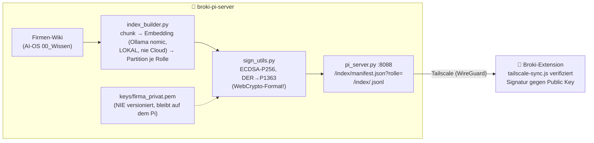

# 🍓 Broki Pi-Server — Wissens-Verteiler (Gegenstück zur Extension)

Baut aus dem Firmen-Wiki den **signierten, rollenbasierten RAG-Vektorindex** und
liefert ihn über Tailscale an die Broki-Browser-Extensions. Läuft auf dem
Raspberry Pi 4 (oder für Dogfooding lokal auf dem Entwickler-Rechner).

## Architektur



## Schnellstart

```bash
# 1. Index bauen (erzeugt beim ersten Lauf das Schlüsselpaar + gibt Public Key aus)
python index_builder.py                    # nutzt AI-OS 00_Wissen
python index_builder.py --quelle <pfad>    # anderes Wiki

# 2. Public Key aus der Ausgabe (oder index_data/public_key.txt) in die Extension
#    kopieren: broki-extension/config/broki-config.js → firmenPublicKeySpkiB64

# 3. Server starten
python pi_server.py                         # :8088, 0.0.0.0 (Tailscale-erreichbar)
```

## Rollen

`index_builder.py` → `ROLLEN`: `mitarbeiter` (offizielles Wiki) und `admin` (alles).
`01_Persönlich` ist immer ausgeschlossen. Neue Rolle = neuer Eintrag + Ordnerliste.

## Sicherheit

- **Integrität:** ECDSA-P256 über SHA-256 jedes Pakets. Der private Schlüssel
  bleibt auf dem Pi; die Extension kennt nur den Public Key und verifiziert VOR
  dem Entpacken. Manipulation auf dem Pi → Signatur ungültig → Extension sperrt.
- **Format-Detail:** WebCrypto verlangt P1363 (r||s, 64 Byte), nicht Pythons
  DER-Default. `sign_utils.py` konvertiert. Beweis: `python test_signatur.py`
  (Python signiert → Node/WebCrypto verifiziert echt=✓, manipuliert=✗).
- **Vertraulichkeit:** übernimmt Tailscale (WireGuard). Kein Schreib-Endpunkt,
  keine Zugriffs-Logs, pfadsicher (nur `<rolle>.jsonl` aus `index_data/`).
- **00_Wissen bleibt lokal:** Embeddings über Ollama `nomic-embed-text` — das
  Firmenwissen verlässt das Gerät nie (gleiche Regel wie der AI-OS-RAG).

## Deployment auf den echten Pi

`pi-ki-tiep.tailed32d1.ts.net` — Repo klonen, `pip install cryptography`,
Ollama mit `nomic-embed-text` bereitstellen (oder Embeddings vorab bauen und nur
`index_data/` + `pi_server.py` deployen), als systemd-Service starten. Die
Extension-`basisUrl` zeigt bereits auf diese Adresse.
